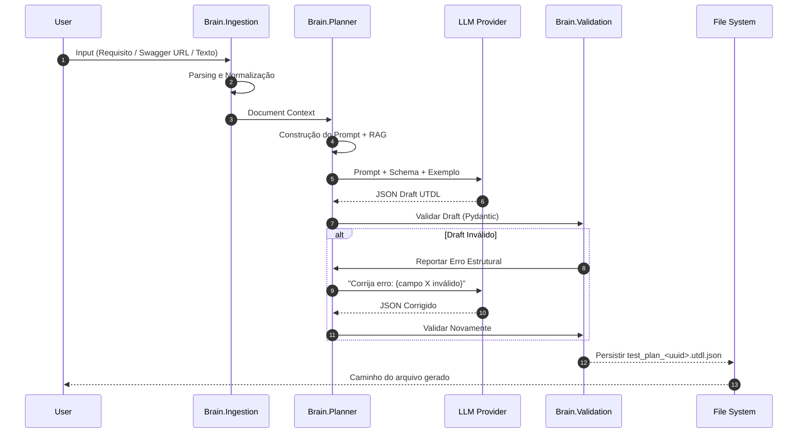
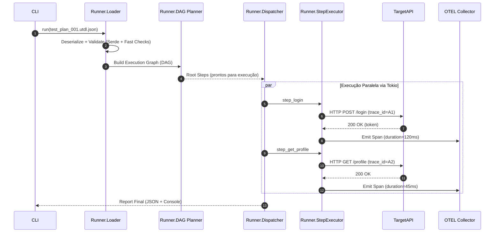
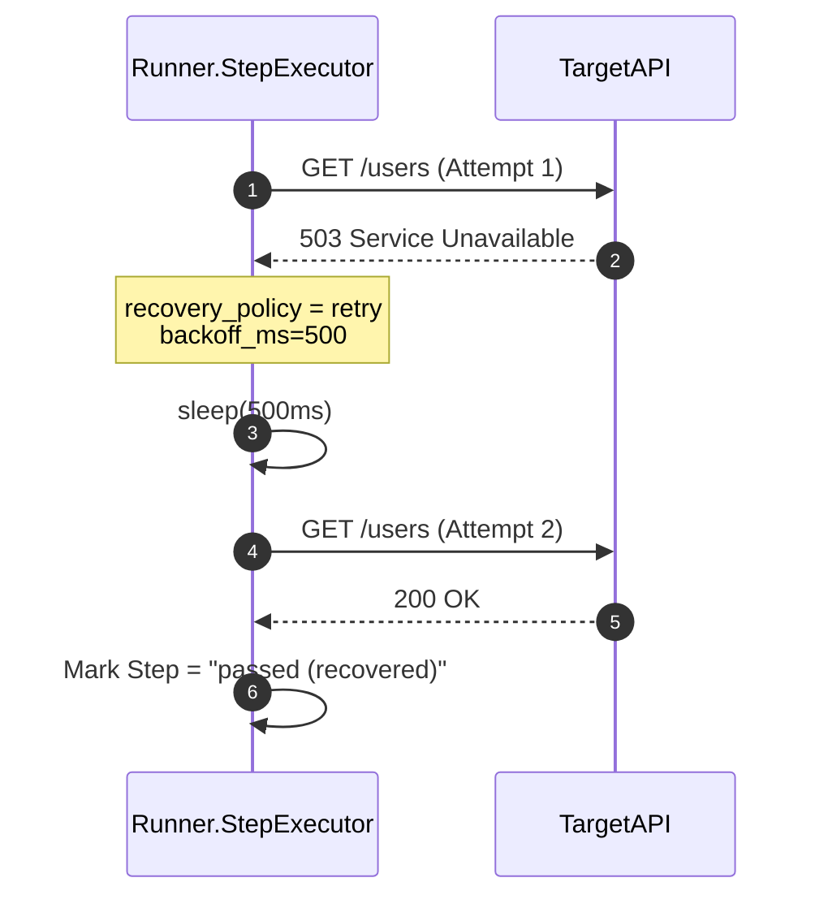
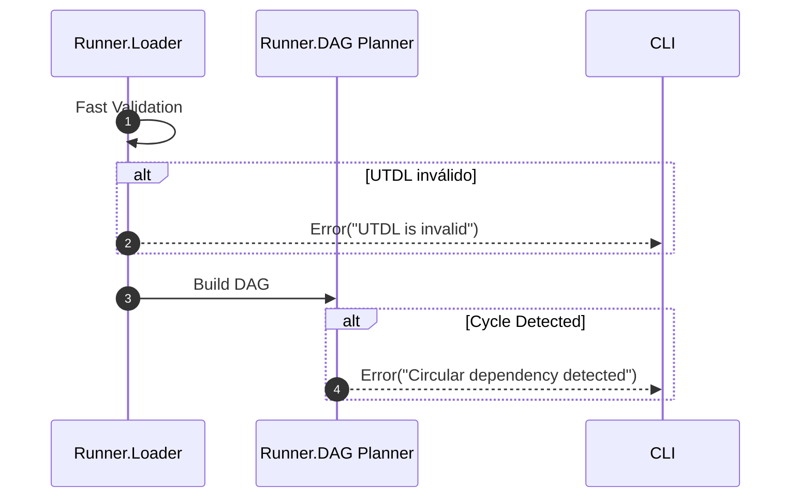
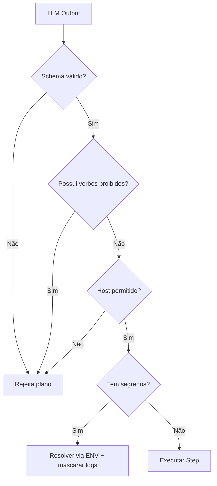

# Projeto: Autonomous Quality Agent (MVP v1.0)

## INDICE

 1. Introdução e Escopo

- **Visão Geral:** O que estamos construindo em 1 parágrafo.

- **Objetivos do MVP:** O que deve funcionar na v1.0 (API Testing, Ingestão de Requisitos).

- **Fronteiras (Out of Scope):** O que **não** faremos agora (Vídeo, UI complexa) para blindar a engenharia.

- **Glossário:** Definição de termos (Brain, Runner, UTDL, Test Plan).

 2. Arquitetura de Alto Nível (C4 Model - Level 1 & 2)

- **Diagrama de Contexto:** Como o sistema se conecta com o mundo (Jira, GitHub, Datadog).

- **Diagrama de Containers:** A visão macro dos 3 grandes blocos.

  - 🐍 **Brain (Python):** Orquestração e IA.

  - 🦀 **Runner (Rust):** Execução de alta performance.

  - 📊 **Intelligence (Julia/Python):** Análise de dados (marcado como stub no MVP).

  - 📜 **Contract (UTDL):** O protocolo de comunicação.

 3. Especificação do Contrato: UTDL (The Core)

- _Este é o capítulo mais importante. Se isso estiver errado, nada funciona._

- **Estrutura do JSON:** Definição dos campos raiz (`meta`, `config`, `steps`).

- **Step Definitions:** Schema para cada tipo de ação (`http_request`, `wait`, `assert`).

- **State Management:** Como passar variáveis de um passo para outro (Output Extraction).

- **Exemplo Completo:** Um JSON real de um teste de login.

 4. Detalhamento de Componentes: The Brain (Python)

- **Ingestion Pipeline:** Como transformamos texto/Swagger em prompt.

- **LLM Integration:** Estratégia de prompts (System Prompts) e escolha de modelo.

- **Validation Layer:** Como o Python garante que o JSON gerado pela IA é válido antes de enviar para o Rust.

5. Detalhamento de Componentes: The Runner (Rust)

- **Concurrency Model:** Como usar `Tokio` para rodar testes em paralelo.

- **Execution Traits:** A interface interna (`Executor` trait) que permite plugar HTTP hoje e Browser amanhã.

- **Telemetry Engine:** Como injetar OpenTelemetry em cada request.

 6. Fluxos de Dados (Sequence Diagrams)

- **Fluxo 1: Criação:** Requisito (Input) -> Brain -> UTDL (Output).

- **Fluxo 2: Execução:** UTDL -> Runner -> HTTP Calls -> Result Aggregation.

- **Fluxo 3: Self-Healing (MVP):** Falha -> Retry Policy -> Report.

 7. Estrutura do Repositório (Monorepo)

- Organização de pastas (`/brain`, `/runner`, `/shared-schemas`).

- Stack Tecnológica detalhada (versões do Python, Rust, bibliotecas principais).

 8. Roadmap Técnico

- Fases de implementação:

  - Fase 1: O "Hello World" (Python gera JSON estático, Rust executa).

  - Fase 2: Conexão com LLM real.

  - Fase 3: Integração CLI/Interface.

## 1. Introdução e Escopo

### 1.1 Visão Geral do Sistema

O **Autonomous Quality Agent** é uma plataforma de engenharia de qualidade projetada para transformar requisitos brutos, documentação técnica e modelos funcionais em **suítes de testes executáveis**, de forma autônoma e orientada por IA.

Diferente de frameworks tradicionais de automação (Cypress, Selenium, Postman), que dependem de scripts manuais e conhecimento técnico aprofundado, o sistema opera como um **Agente Inteligente de Qualidade**: ele compreende o comportamento esperado do software, planeja os testes necessários e os executa com performance nativa.

A arquitetura é fundamentada no desacoplamento estrito entre Inteligência e Execução:

- **The Brain (Python+ IA):** Interpreta requisitos, consulta LLMs, acessa documentação, gera planos de teste, realiza análises semânticas e interpreta falhas.

- **The Runner (Rust):** Executa cenários com alta concorrência, baixa latência e eficiência extrema, atuando como motor determinístico e confiável..

- **UTDL (Protocolo):** Uma linguagem intermediária agnóstica que serve como contrato entre o o Brain (cérebro) e o Runner (motor). Toda automação é expressa neste formato, não em código.
 Esta separação permite evolução independente dos módulos, evitando dependência em ferramentas externas e garantindo longevidade da solução.

### 1.2 Objetivos do MVP (v1.0)

O foco da versão 1.0 é validar a capacidade da IA de gerar planos de testes de API coerentes e a capacidade do Runner de executá-los com performance superior a soluções interpretadas.

- **Autonomia de Geração:** Ingerir texto livre ou Swagger (OpenAPI) e gerar um plano de testes (UTDL) sintaticamente válido sem intervenção humana.

- **Execução de Alta Performance:** Executar testes de API (HTTP) em paralelo utilizando o modelo de concorrência do Rust (`Tokio`), superando a velocidade de execução de runners baseados em Node.js ou Python.

- **Resiliência Básica:** Implementar políticas de _retry_ configuráveis via protocolo para mitigar "flaky tests" de rede.

- **Observabilidade:** Fornecer logs estruturados e relatório de execução claro (Pass/Fail + Motivo).

- **Validação Estrutural:** Implementar o primeiro **JSON Schema UTDL v0.1** com validação rígida para evitar geração incorreta.

### 1.3 Fronteiras do Escopo (In vs. Out)

Para garantir a entrega e a qualidade da engenharia, definimos limites rígidos para o MVP.

| **✅ IN SCOPE (O que faremos)**                      | **⛔ OUT OF SCOPE (O que NÃO faremos agora)**                             |
| --------------------------------------------------- | ------------------------------------------------------------------------ |
| **Domínio:** Testes de API REST (JSON/HTTP).        | **Domínio:** Testes de UI (Browser), Mobile, gRPC ou WebSocket.          |
| **Input:** Texto (Requisitos) e JSON (Swagger).     | **Input:** Vídeo, Imagens ou navegação gravada.                          |
| **Engine:** Executor HTTP assíncrono em Rust.       | **Engine:** Integração com Selenium, Playwright ou Appium.               |
| **Auth:** Suporte a Bearer Token e API Key simples. | **Auth:** Fluxos complexos de OAuth2 com MFA ou Captcha.                 |
| **Output:** Relatório JSON/Console e Logs.          | **Output:** Dashboards gráficos complexos ou integração nativa com Jira. |
| **Infra:** Execução local (CLI).                    | **Infra:** Orquestração distribuída (Kubernetes/Cluster).                |
| Persistência mínima em arquivo                      | Banco de dados, multi-tenancy                                            |

 O foco é comprovar que o sistema funciona end-to-end no domínio de API.

### 1.4 Glossário Técnico

Para evitar ambiguidade durante o desenvolvimento, definimos os seguintes termos:

- **UTDL (Universal Test Definition Language):** O esquema JSON proprietário que descreve _o que_ deve ser testado. É o produto final do "Brain" e a entrada do "Runner".

- **Test Plan (Plano de Teste):** Um arquivo UTDL completo contendo configurações e uma lista de cenários (Steps) a serem executados em uma ordem lógica.

- **Step (Passo):** A menor unidade de execução atômica (ex: "Fazer um POST em /login").

- **Context Variables:** Variáveis que surgem durante os steps (ex: `auth_token`) e são usadas nos próximos passos.

- **Extract:** Regras que extraem valores da resposta e os salvam em variáveis.

- **Recovery Policy:** Estratégias para lidar com falhas (retry, backoff, abort, ignore).

- **Brain:** O subsistema em Python que interage com LLMs e VectorDBs.

- **Runner:** O binário compilado em Rust que consome UTDL e interage com o alvo (Target System).

- **Target System:** O sistema sob teste (API ou serviço externo).

- **Assertion:** Uma regra lógica (ex: `status_code == 200`) que define se um passo passou ou falhou.

## 2. Arquitetura de Alto Nível (C4 Model)

Esta seção descreve a arquitetura estática e dinâmica do _Autonomous Quality Agent_. O design prioriza o **desacoplamento** entre a inteligência (tomada de decisão) e a execução (ação), unidos estritamente pelo protocolo UTDL.

### 2.1 Diagrama de Contexto (Level 1)

O diagrama abaixo ilustra como o sistema se situa no ecossistema da empresa. O Agente atua como um intermediário autônomo entre o Engenheiro de QA, as fontes de conhecimento e o sistema alvo.

```mermaid
graph TD
    %% Atores
    User[QA Engineer / Dev / DevOps]

    %% Sistemas Externos
    Jira[Documentation Source\n(Jira / Confluence / Swagger)]
    TargetAPI[Target System\n(API REST)]
    LLM[LLM Provider\n(OpenAI / Claude / Local)]
    Observability[Observability Platform\n(Datadog / Grafana / New Relic)]

    %% O Sistema
    subgraph Core_System [Autonomous Quality Agent]
        BrainRunner[Brain + Runner\n(Autonomous Quality Agent)]
    end

    %% Relações
    User -->|Define requisitos / Revisa planos / Dispara execuções| BrainRunner

    BrainRunner -->|Lê specs e docs| Jira
    BrainRunner -->|Envia prompts / contexto| LLM
    BrainRunner -->|Executa testes HTTP| TargetAPI
    BrainRunner -->|Envia traces & métricas (OTEL)| Observability

```

**Principais Decisões de Design:**

1. **Observabilidade Nativa:** O sistema não pretende ser uma “caixa preta de logs”.  Toda execução emite **telemetria padrão (OpenTelemetry)**, permitindo que os testes apareçam nas ferramentas já utilizadas pela empresa (Datadog, Grafana, New Relic, etc.).

2. **LLM Agnostic:** O sistema consome LLMs como um _commodity_. Se trocarmos GPT-4 por Llama3 local, a arquitetura permanece intacta.

3. **Segregação de Responsabilidades:**

- O usuário interage com o sistema (definição/revisão de testes).

- O sistema interage com documentação, LLM e sistemas alvo.

- A fronteira é sempre clara: o usuário não precisa escrever código de teste, apenas revisar e aprovar planos.

---

### 2.2 Diagrama de Containers (Level 2)

Aqui explodimos a caixa preta do "Agente" para revelar os subsistemas internos e como eles se comunicam.

```mermaid
graph TB
    %% Interface
    CLI[Interface CLI / Web Minimal]

    %% Brain
    subgraph Brain [The Brain (Python)]
        Ingestion[Ingestion Engine\n(Swagger / Texto / Markdown)]
        Planner[Test Planner & UTDL Generator]
        ContextDB[(Vector Memory / Metadata DB)]
    end

    %% Protocol
    subgraph Protocol [The Protocol]
        UTDL_File(UTDL JSON Artifact\n(Test Plan))
    end

    %% Runner
    subgraph Runner [The Runner (Rust)]
        Loader[UTDL Parser & Validator]
        Executor[Async HTTP Executor\n(Tokio + Reqwest)]
        Telemetry[OTEL Emitter]
    end

    %% Intelligence
    subgraph Intelligence [Intelligence Engine\n(Julia Futuro / Python MVP)]
        Analytics[Optimization & Analytics Engine]
    end

    %% Sistemas Externos
    Docs[Docs & Specs\n(Jira / Confluence / Swagger)]
    LLM[LLM Provider]
    TargetAPI[Target API\n(System Under Test)]
    Observability[Observability Platform]

    %% Fluxos
    CLI -->|Comandos / Entrada de requisitos| Ingestion
    Ingestion -->|Documentos normalizados| Planner
    Docs -->|Requisitos / Especificações| Ingestion

    Planner <-->|Busca contexto\n(RAG / histórico)| ContextDB
    Planner -->|Test Plan\n(UTDL)| UTDL_File

    UTDL_File -->|Consome| Loader
    Loader --> Executor

    Executor -->|HTTP Requests| TargetAPI
    Executor -->|Execution Results| Analytics
    Executor -->|Logs estruturados / Traces| Telemetry
    Telemetry -->|Traces & Métricas| Observability

    Analytics -->|Estatísticas & Insights| ContextDB
    Planner -->|Prompts & contexto| LLM
    LLM -->|Respostas / sugestões| Planner

    Executor -->|Resumo de execução| CLI

```

### 2.3 Descrição dos Componentes

#### **A. The Brain (Camada de Inteligência)**

- **Tecnologia:** Python 3.11+

- **Papel:** Atua como “arquiteto e compilador” de testes. Recebe intenções humanas, documentos e specs, e transforma isso em artefatos UTDL executáveis.

**Subcomponentes:**

- **Ingestion Engine**

  - Parsers para:

    - OpenAPI/Swagger (JSON/YAML)

    - Markdown (Confluence, docs internas)

    - Texto livre

  - Normaliza essas fontes em uma representação interna de requisitos e endpoints.

- **Test Planner & UTDL Generator**

  - Constrói o **grafo de dependências** de chamadas (ex: precisa logar antes de consultar perfil).

  - Usa LLM + heurísticas para:

    - gerar casos de teste

    - derivar variações (válido, inválido, limites, erro esperado)

  - Compila tudo em um **Test Plan UTDL**.

- **ContextDB (Vector Memory / Metadata)**

  - Armazena:

    - embeddings de documentos

    - histórico de execuções

    - metadados de falhas (flaky, críticos, etc.)

  - Alimenta o Planner com contexto (RAG) para reduzir alucinação e duplicação de testes.

#### **B. The Bridge (Protocolo UTDL)**

- **Tecnologia:** JSON + JSON Schema (Draft 2020-12)

- **Papel:** É o **contrato formal** entre o Brain e o Runner.

Características:

- Representa:

  - metadados do plano (nome, prioridade, tags)

  - configuração global (base_url, timeout, headers)

  - steps (ação, parâmetros, asserts, extrações, políticas de recuperação)

- É desenhado para ser:

  - legível por humanos

  - validável por schema

  - fácil de versionar (Git)

  - independente da linguagem de implementação

**Decisão de design:**
Troca por arquivo/stream JSON em vez de chamadas diretas:

- Permite que Brain e Runner rodem em processos ou máquinas separados.

- Facilita debug (basta inspecionar o JSON).

- Abre espaço para outros executores futuros (ex: um Runner em Go).

#### **C. The Runner (Camada de Execução)**

- **Tecnologia:** Rust (Tokio, Reqwest, Tracing/OpenTelemetry)

- **Papel:** É o “operário determinístico”. Recebe um plano UTDL e o executa com máxima eficiência.

**Subcomponentes:**

- **UTDL Parser & Validator (Loader)**

  - Valida o JSON contra o schema UTDL.

  - Rejeita planos inválidos antes de iniciar execução.

  - Constrói uma estrutura em memória otimizada para execução.

- **Async HTTP Executor**

  - Dispara requisições HTTP em paralelo de forma assíncrona.

  - Implementa:

    - timeout por step

    - retry conforme `recovery_policy`

    - controle de concorrência global (limite de conexões)

- **Telemetry (OTEL Emitter)**

  - Converte cada step em spans / traces OTEL.

  - Envia métricas e logs estruturados para ferramentas de observabilidade.

#### **D. Intelligence Engine (Camada Analítica - Stub no MVP)**

- **Tecnologia:**

  - MVP: Python (pandas, basic stats)

  - Futuro: Julia (análise estatística e otimização)

- **Papel:** Analisa execuções e retroalimenta o Brain.

**No MVP (v1.0):**

- calculadora simples de:

  - taxa de sucesso/falha

  - latência média por endpoint

  - marcação de testes instáveis (flaky)

**Visão futura:**

- priorização de testes por risco

- análise de impacto

- recomendação de quais testes rodar para cada mudança de código

---

### Avaliação de Riscos Arquiteturais

- **Latência de Geração (LLM)**

  - _Risco:_ Planos de teste podem demorar segundos/minutos para serem gerados.

  - _Mitigação:_

    - Cache de UTDL por hash de requisito/spec.

    - Reutilização de planos quando não há mudanças.

- **Dessincronia de Protocolo (Brain vs Runner)**

  - _Risco:_ O Brain pode gerar JSON que o Runner ainda não sabe interpretar.

  - _Mitigação:_

    - Versão explícita de schema (`utdl_version`).

    - Validação rígida no Brain antes de enviar ao Runner.

    - Testes de contrato entre módulos.

- **Segurança de Segredos e Dados Sensíveis**

  - _Risco:_ Segredos (tokens, senhas) podem ser incluídos em UTDL ou logs.

  - _Mitigação:_

    - Uso de placeholders (`${SECRET_*}`) em UTDL.

    - Resolução de segredos feita apenas no Runner via variáveis de ambiente.

    - Redação de campos sensíveis em logs/telemetria.

- **Overhead de Telemetria**

  - _Risco:_ Emissão intensa de traces pode impactar performance em cargas altas.

  - _Mitigação:_

    - Configuração de amostragem (sampling) de OTEL.

    - Possibilidade de rodar em modo “silent” (telemetria mínima) para stress tests.

---

## 3. Especificação do Contrato: UTDL (Universal Test Definition Language)

A **UTDL** é a linguagem intermediária oficial do _Autonomous Quality Agent_. É um formato baseado em **JSON**, estritamente tipado, projetado para:

- ser **gerada pelo Brain (Python/LLM)**

- ser **interpretada pelo Runner (Rust)**

- permitir evolução independente entre ambos

O formato é **JSON estruturado**, validado rigidamente por **JSON Schema**.

### 3.1 Objetivo da Linguagem

A UTDL descreve:

- **o que deve ser testado**

- **como deve ser testado**

- **quais critérios definem sucesso ou falha**

- **como lidar com falhas**

- **como encadear passos**

Ela **não** contém:

- loops

- condicionais imperativas

- funções customizadas

- lógica de programação arbitrária

A ideia é:

> _“Plano de teste como dados, não como código.”_
---

### 3.2 Estrutura Raiz (Root Object)

Todo arquivo `.utdl` ou payload deve respeitar a seguinte estrutura raiz:

JSON

```json
{
  "spec_version": "0.1",
  "meta": {
    "id": "UUID-v4",
    "name": "Human readable name",
    "description": "Optional description",
    "tags": ["api", "critical", "regression"],
    "created_at": "ISO8601 timestamp"
  },
  "config": {
    "base_url": "https://example.com",
    "timeout_ms": 5000,
    "global_headers": { "Content-Type": "application/json" },
    "variables": {
      "env": "staging",
      "retry_count": 3
    }
  },
  "steps": []
}
```

_**Tipos dos campos:**_

|Campo|Tipo|Obrigatório|
|---|---|---|
|spec_version|string|✔|
|meta|object|✔|
|config|object|✔|
|steps|array|✔|

---

### 3.3 Definição de Passo (The Step Object)

Cada item no array `steps` representa uma ação atômica. O Runner deve suportar polimorfismo baseado no campo `action`.

_**Schema Geral:**_

```json
{
  "id": "unique_step_id",
  "description": "Optional human-friendly text",
  "depends_on": ["id1", "id2"],
  "action": "http_request",
  "params": { ... },
  "assertions": [ ... ],
  "extract": [ ... ],
  "recovery_policy": { ... }
}
```

**Campos Comuns:**

|Campo|Tipo|Obrigatório|Descrição|
|---|---|---|---|
|id|string|✔|Identificador único|
|description|string|❌|Texto para logs|
|depends_on|array[string]|❌|Permite DAG|
|action|enum|✔|Tipo da operação|
|params|object|✔|Parâmetros da ação|
|assertions|array|❌|Regras de validação|
|extract|array|❌|Regras de extração|
|recovery_policy|object|❌|Política de resiliência|

---

### 3.4 Ação: `http_request` (Core MVP)

Esta é a estrutura para chamadas de API.

JSON

```json
{
  "id": "create_user",
  "action": "http_request",
  "params": {
    "method": "POST",
    "path": "/users",
    "headers": {
      "Content-Type": "application/json",
      "Authorization": "Bearer ${auth_token}"
    },
    "body": {
      "name": "Teste User",
      "email": "teste-${random_uuid}@email.com"
    }
  },
  "assertions": [ ... ],
  "extract": [ ... ],
  "recovery": { ... }
}
```

_**Campos de Params:**_

|Campo|Tipo|Obrigatório|
|---|---|---|
|method|string (GET/POST/PUT/DELETE…)|✔|
|path|string|✔|
|headers|object|❌|
|body|any|❌|

---

### 3.5 Assertions (Sistema de Validação)

A UTDL define um conjunto padrão de asserts.

#### Tipos suportados

|type|Descrição|
|---|---|
|**status_code**|valida HTTP status|
|**latency**|valida tempo de resposta|
|**json_body**|valida campo específico|
|**header**|valida headers|

#### **Exemplo:**

```json
"assertions": [
  { "type": "status_code", "operator": "eq", "value": 201 },
  { "type": "latency", "operator": "lt", "value": 500 },
  {
    "type": "json_body",
    "path": "data.user.role",
    "operator": "eq",
    "value": "admin"
  }
]
```

---

### 3.6 Extract & Interpolation (Gerenciamento de Estado)

O sistema deve ser capaz de passar dados de um passo para outro (ex: Login -> Token).

**Extração (`extract`):** Retira dados da resposta e salva na memória do Runner.

```json
"extract": [
  {
    "source": "body", // ou 'header'
    "path": "auth.access_token", // JsonPath
    "target": "auth_token" // Nome da variável
  }
]
```

#### Interpolation

Aparece em qualquer string:

- `${jwt}`

- `${random_uuid}`

- `${timestamp}`

- `${ENV_ADMIN_PASS}`

### 3.7 Resiliência (Recovery Policy)

Define o que fazer em caso de falha (Network error, 5xx, Timeout).

```json
"recovery_policy": {
  "strategy": "retry", // ou 'fail_fast', 'ignore'
  "max_attempts": 3,
  "backoff_ms": 500, // Tempo de espera entre tentativas
  "backoff_factor": 2.0 // Exponencial (500ms -> 1000ms -> 2000ms)
}
```

#### Estratégias possíveis

- retry

- fail_fast

- ignore

---

### 3.8 Invariantes da UTDL _(essenciais para o MVP)_

- `id` de steps **deve ser único**.

- `depends_on` **não pode criar ciclos** (DAG only).

- Toda variável interpolada deve ter valor disponível em:

  - config.variables

  - extract

  - ambiente (ENV_*)

  - funções mágicas

- Falha em qualquer assert → step falha.

- Em caso de falha:

  - se recovery_policy = retry → aplicar

  - caso contrário → step encerra e o Runner para o fluxo dependente

---

### 3.9 Exemplo Completo (“Hello World” do MVP)

Este é o JSON que o Python deve gerar e o Rust deve executar no MVP.

```json
{
  "spec_version": "0.1",
  "meta": {
    "id": "flow-auth-001",
    "name": "Fluxo de Autenticação e Perfil",
    "created_at": "2025-11-30T15:00:00Z"
  },
  "config": {
    "base_url": "https://api.staging.exemplo.com",
    "timeout_ms": 5000
  },
  "steps": [
    {
      "id": "step_login",
      "action": "http_request",
      "description": "Realiza login para obter token",
      "params": {
        "method": "POST",
        "path": "/v1/auth/login",
        "body": {
          "user": "admin",
          "pass": "${ENV_ADMIN_PASS}"
        }
      },
      "assertions": [
        { "type": "status_code", "operator": "eq", "value": 200 }
      ],
      "extract": [
        { "source": "body", "path": "token", "target": "jwt" }
      ]
    },
    {
      "id": "step_get_profile",
      "depends_on": ["step_login"],
      "description": "Usa o token para buscar dados do perfil",
      "depends_on": ["step_login"],
      "action": "http_request",
      "params": {
        "method": "GET",
        "path": "/v1/users/me",
        "headers": {
          "Authorization": "Bearer ${jwt}"
        }
      },
      "assertions": [
        { "type": "status_code", "operator": "eq", "value": 200 },
        { "type": "json_body", "path": "email", "operator": "contains", "value": "@" }
      ]
    }
  ]
}
```

---

## 4. Detalhamento de Componentes: The Brain (Python)

O subsistema **Brain** é responsável pela camada cognitiva da arquitetura. Ele transforma **requisitos brutos** em **planos de teste estruturados**, garantindo que:

- todo UTDL gerado é sintaticamente válido

- não há geração de testes incoerentes

- o Runner **nunca** receba um JSON inválido

- todo fluxo é deterministicamente reprodutível

O Brain _nunca_ executa testes.
Sua responsabilidade é exclusivamente **planejar, compilar e validar.**

---

### 4.1 Responsabilidades Principais

1. **Ingestão de Contexto:** Normalização de documentos (Swagger, texto, markdown) em uma estrutura interna.

2. **Orquestração de LLM:** Coordena prompts, exemplos, correções e reforço semântico.

3. **Geração Estruturada:** Compila a intenção do usuário → Test Plan UTDL completo.

4. **Validação Preventiva:** Garante que _nenhum_ plano inválido chegue ao Runner.

5. **Gerenciamento de Memória (Vector DB):** Mantém histórico, contexto e documentos relevantes para reduzir repetição e alucinação.

6. **Autocorreção (Self-Correction Loop):** Conversa iterativamente com a IA até obter JSON válido.

---

### 4.2 Stack Tecnológica (MVP)

- **Linguagem:** Python 3.11+ (Tipagem forte).

- **Validation:** `Pydantic v2` (Para forçar o schema UTDL).

- **LLM Interface:** `LiteLLM` (preferido), `OpenAI SDK` direto ou `LangChain` (Para abstrair OpenAI/Claude/Local).

- **Vector DB:** `ChromaDB` (local).

- **API Parser:** `prance` ou `openapi-spec-validator` (Para ler Swaggers).

- **Utils:** `jsonschema`, `rapidfuzz`, `python-json-logger`.

---

### 4.3 Pipeline de Interno (Architecture Flow)

O fluxo interno do Brain segue o padrão **Retrieval-Generation-Validation Loop**:

> **Retrieve → Generate → Validate → Correct → Approve → Emit**

1. **Ingestion Layer:**

    - Recebe o input bruto e converte entrada para um formato interno.

    - Se for Swagger/OpenAPI: Converte para um resumo simplificado (endpoints, métodos, params obrigatórios).

    - Se for Texto: Limpa e faz extração de endpoints via heurística.

2. **Context Builder:**

- Recupera do Vector DB:

  - exemplos similares

  - documentação relevante

  - testes anteriores

- Constrói o prompt completo:

  - regras rígidas

  - schema

  - exemplos

  - restrições de segurança

3. **LLM Interaction:**

    - Envia o prompt para o modelo (GPT-5 / Claude 4.5 ou outro recomendado para lógica complexa).

    - Solicita resposta em formato JSON puro.

    - Recebe UTDL _candidato_.

4. **Validation Guardrails (Pydantic):**

- UTDL é validado via Pydantic + JSON Schema.

- Se falhar:

  - Brain cria “Error Feedback Prompt”

  - Envia erro à IA

  - IA corrige e reenvia apenas o JSON

5. **Validation Guardrails (Pydantic):**
 Quando válido, salva:

- `test_plan_<uuid>.utdl.json`

- hash SHA-256 para versionamento

---

### 4.4 Estratégia de Prompt (System Prompt Design)

O prompt do sistema é o componente mais crítico da "programação em linguagem natural".

Ele contém:

1. **Persona**: “Você é um Engenheiro de QA Sênior especialista em automação.”

2. **Objetivo**: “Gere planos UTDL v0.1 válidos, sem explicações.”

3. **Regras rígidas**:

    - “Somente JSON”

    - “Respeite estritamente o schema”

    - “Crie dependências lógicas quando necessário”

4. **Schema completo embutido**

5. **Exemplo de saída válida**

6. **Modo estrito**: erros devem ser corrigidos imediatamente.

**System Prompt Template (Draft):**
> "Você é um Engenheiro de QA Sênior especializado em automação. Sua tarefa é analisar a documentação da API fornecida e gerar um plano de testes completo no formato UTDL v0.**1**.
>
> REGRAS ESTRITAS:
>
> 1. Sua saída DEVE ser estritamente um JSON válido seguindo o formato UTDL v0.1.
>
> 2. NÃO inclua explicações ou markdown fora do JSON.
>
> 3. Use variáveis `${var}` para dados dinâmicos.
> SCHEMA OBRIGATÓRIO: {schema_structure_here}
> EXEMPLO DE SAÍDA VÁLIDA: {utdl_example_here}"
> 4. Crie dependências lógicas: se um endpoint cria um recurso, o próximo deve consultá-lo.
>

---

### 4.5 Componente de Validação (The Guard)

Utilizaremos o Pydantic para definir a UTDL dentro do código Python. Isso garante que o Python e o Rust (que lerá o JSON) estejam sempre alinhados.

Implementado em:

```bash
`brain/schemas/utdl.py`
```

### Funções essenciais

- **estrutura do plano**

- **tipos dos campos**

- **assertions válidos**

- **depêndencias que existem**

- **detecção de ciclos em depends_on**

- **nomes de variáveis válidos**

- **policy de retry válida**

Exemplo Resumido:

```python
# brain/schemas/utdl.py

from pydantic import BaseModel, Field, field_validator
from typing import List, Optional, Dict, Literal

class Step(BaseModel):
    id: str
    action: Literal['http_request', 'wait']
    depends_on: Optional[List[str]] = None
    # ... outros campos

class UTDLPlan(BaseModel):
    spec_version: Literal["0.1"] = "0.1"
    meta: Meta
    config: Config
    steps: List[Step]

    @field_validator("steps")
    def validate_dependencies(cls, steps):
        ids = {s.id for s in steps}
        for s in steps:
            if s.depends_on:
                for d in s.depends_on:
                    if d not in ids:
                        raise ValueError(f"Unknown step dependency: {d}")
        return steps
```

---

### 4.6 Integração com o Runner

O Brain invoca o Runner via **execução local**:

### Fluxo MVP

- Brain salva arquivo:

  - `./plans/<uuid>.utdl.json`

- Brain executa:

```css
  ./runner --file <uuid>.utdl.json --report out_<uuid>.json
```

- Runner gera:

  - `/reports/out_<uuid>.json`

  - logs OTEL (se configurado)

- Brain lê o report estruturado.

#### Motivação desta arquitetura

- simples

- debugável

- desacoplada

- fácil de testar

---

### 4.7 Invariantes do Brain

O Brain **sempre** garante:

1. **Nenhum UTDL inválido chega ao Runner.**

2. **Nenhum step contém ação desconhecida.**

3. **Nenhuma variável é interpolada sem existir previamente.**

4. **Nenhum plano contém ciclos em depends_on.**

5. **Nenhum segredo aparece em texto puro** (sempre `${ENV_*}`).

6. **Toda saída é JSON puro** (nunca texto extra).

7. **Toda geração é reproduzível**, pois:

    - prompt

    - contexto

    - exemplo

    - hash
        são persistidos.

---

### 4.8 Gerenciamento de Erros da LLM

Política de retry:

|Tentativa|Ação|
|---|---|
|1|Gerar plano normal|
|2|Corrigir erros estruturais|
|3|Modo estrito: Brain reescreve parte do prompt|
|4|Abortar com erro|

Se a IA insistir em enviar JSON inválido:
**Brain aborta. Runner nunca recebe lixo.**

---

### **4.9 Caching e Versionamento**

Cada plano possui:

- `plan_id`

- `created_at`

- `sha256_hash`

- `source_context_hash` (para detectar mudanças)

Regras:

- Se hash da input = hash já visto → usar plano antigo.

- Se input mudou → regenerar.

---

### **4.10 Segurança**

O Brain:

- nunca resolve segredos

- nunca armazena tokens

- substitui tudo por `${ENV_*}`

- valida se nenhuma string contém algo sensível (regex heuristic)

---

### **4.11 Interface Formal do Brain (API interna)**

**Métodos internos (MVP):**

- `generate_utdl(raw_input: str) -> UTDLPlan`

- `validate(utdl: dict) -> UTDLPlan`

- `persist_plan(plan: UTDLPlan) -> Path`

- `invoke_runner(path: Path) -> Report`

- `feedback_to_llm(error: str) -> dict`

---

### **4.12 Fluxo Dinâmico Completo**

```scss
User Input
    ↓
Ingestion Layer
    ↓
Vector Memory (context retrieval)
    ↓
Context Builder
    ↓
LLM (generation)
    ↓
Validation Guard (Pydantic)
    ├── OK → Save & Execute Runner
    └── FAIL → Error Feedback Prompt → regenerate

```

___

### Por que essa abordagem é robusta?

1. **Type Safety:** Usar Pydantic significa que não vamos enviar lixo para o Rust. Se a IA alucinar um campo `action: "magic_click"`, o Python explode o erro antes de tentar rodar.

2. **Self-Correction:** O loop de re-prompting (item 4.3) resolve 80% dos erros comuns de geração de JSON das IAs.

3. **Modularidade:** Se amanhã quisermos trocar o GPT-5 pelo Llama-3 rodando local, mudamos apenas a classe `LLMInterface`, o resto do pipeline de validação se mantém.

___

## 5. Detalhamento de Componentes: The Runner (Rust)

O **Runner** é o motor determinístico da plataforma.
É um binário Rust autocontido responsável por:

- carregar e validar o plano UTDL

- executar cada step com máxima eficiência

- gerenciar contexto e dependências

- capturar telemetria estruturada

- produzir um relatório formal de execução

O Runner **não planeja, não pensa, não interpreta documentação**.
Ele **executa** ordens declaradas no UTDL.

### 5.1 Stack Tecnológica (The "Ferris" Stack)

|Componente|Tecnologia|Motivação|
|---|---|---|
|Linguagem|**Rust (Edition 2021+)**|Segurança + performance + ausência de GC|
|Runtime|**Tokio**|I/O assíncrono, scheduling eficiente de tasks|
|HTTP|**Reqwest** (MVP)|Ergonomia e velocidade de desenvolvimento|
|Serialização|**Serde / Serde JSON**|Zero-copy parsing, alta performance|
|Concurrency Primitives|tokio::sync / std::sync|Controle explícito, sem data races|
|Observabilidade|tracing + opentelemetry-rust|Logs estruturados e spans OTEL|
|Config|clap / config-rs|CLI robusta (futuro)|
|Scripting (futuro)|Rhai / Boa|Execução leve de lógica embutida|

### 5.2 Modelo de Concorrência (Async Architecture)

O Runner utiliza o modelo:

> **M empresários (threads do sistema)
> N trabalhadores (tasks assíncronas)**
> → distribuídos pelo scheduler do Tokio.

#### Características chave

- Tasks não bloqueiam threads (async/await)

- Enquanto um step aguarda resposta HTTP, o thread executa outro step → **zero desperdício**

- É possível lançar **milhares** de tasks simultâneas com poucos MBs de RAM

#### Comparação

|Ferramenta|Modelo|Problemas|
|---|---|---|
|Selenium Grid|1 processo pesado por teste|lento, consome RAM|
|Node.js|Single-thread|gargalo em cargas altas|
|Python Async|GIL limita throughput|escalabilidade baixa|
|**Rust/Tokio**|Multithread + async|ideal para milhares de requests|

---

### 5.3 Arquitetura Interna (Componentes)

A arquitetura é modular e guiada por traits

```bash
src/
 ├── loader/          # Leitura + validação do UTDL
 ├── planner/         # Constrói DAG de execução
 ├── dispatcher/      # Coordena steps e concorrência
 ├── executors/       # Implementações de ações
 │     ├── http.rs
 │     ├── wait.rs
 │     └── … futuros
 ├── context/         # Variáveis, extract, interpolation
 ├── telemetry/       # tracing + otel
 ├── report/          # Estrutura final de saída
 └── main.rs

```

Para garantir que o Runner possa evoluir de API para UI (Browser) sem reescrever o núcleo, utilizaremos o padrão de Traits (Interfaces).

---

### 5.4 O Padrão StepExecutor (Extensibilidade Total)

_**O núcleo é o trait:**_

```rust
// core/traits.rs

use async_trait::async_trait;
use crate::models::{Step, StepResult, Context};

#[async_trait]
pub trait StepExecutor {
    // Verifica se este Executor sabe lidar com essa ação (ex: "http_request")
    fn can_handle(&self, action: &str) -> bool;

    // Executa a ação e retorna o resultado + atualizações de contexto
    async fn execute(&self, step: &Step, context: &mut Context) -> anyhow::Result<StepResult>;
}
```

Executores implementados no MVP:

- **HttpExecutor** → step.action = "http_request"

- **WaitExecutor** → step.action = "wait"

Executores futuros (sem alterar o resto da arquitetura):

- BrowserExecutor (chromium-bidi)

- GRPCExecutor

- WebSocketExecutor

- FileSystemExecutor

### 5.5 Gerenciamento de Estado (Context Engine)

O Context é um dicionário:

```rust
HashMap<String, serde_json::Value>
```

Suporta:

- gravação de valores extraídos (`extract`)

- leitura para interpolação (`${var}`)

- funções internas (`${random_uuid}`, `${timestamp}`)

#### Política de segurança

- valores sensíveis **não são logados**

- valores `${ENV_*}` são resolvidos apenas no Runner

- segredo nunca aparece em logs/traces

#### Política de isolamento

- cada execução tem Context próprio

- nenhum test plan pode vazar valores para outro

---

### 5.6 Pipeline de Execução (The Execution Loop)

Fluxo completo:

#### **1. Load**

- Lê arquivo `.utdl.json`

- Desserializa via Serde

- Validação rápida (tipos, campos)

#### **2. Plan**

- Constrói DAG de steps

- Detecta:

  - steps raiz (sem depends_on)

  - paralelismo possível

  - cycles (erro fatal)

#### **3. Dispatch**

- Cria tasks assíncronas para cada step

- Gerencia dependências:

  - step só roda quando todos em `depends_on` concluiram com sucesso

#### **4. Execute**

- StepExecutor correto é selecionado

- Execução ocorre dentro de `Span` OTEL

- Interpolation é aplicada

- HTTP Request enviado

#### **5. Collect**

- StepResult armazenado

- Se falhou:

  - aplica `recovery_policy`

  - se falha persistir → marca dependentes como “skipped”

#### **6. Report**

Gera arquivo:

```bash
/reports/<id>.json
```

Com:

```json
{
  "plan_id": "flow-auth-001",
  "status": "passed",
  "started_at": "",
  "finished_at": "",
  "steps": [
    {
      "id": "step_login",
      "status": "passed",
      "latency_ms": 120,
      "asserts": [...]
    }
  ]
}

```

---

### 5.7 Telemetria e Logs (Observability)

O Runner não deve apenas imprimir no console. Ele deve ser um cidadão de observabilidade.

#### Tecnologias

- `tracing`

- `opentelemetry_sdk`

- OTLP exporter (gRPC)

#### Cada Step gera

- span com atributos:

  - step_id

  - action

  - method

  - path

  - duration

  - http_status

  - error_message (se houver)

#### Header de propagação

Se configurado:

`traceparent: <id>` → permite rastrear chamadas end-to-end.

- **Exemplo de Log Estruturado:**

```json
{
  "timestamp": "2025-12-01T10:00:00Z",
  "level": "INFO",
  "target": "runner::executors::http",
  "trace_id": "a1b2c3d4...",
  "step_id": "login_step",
  "event": "request_sent",
  "method": "POST",
  "url": "https://api.exemplo.com/login",
  "duration_ms": 120
}
```

---

### 5.8 Políticas de Erro

Erro fatal (abortar plano):

- UTDL inválido

- ciclo em depends_on

- step obrigatório falha mesmo após recovery

- interpolação sem variável definida

- resolver segredo falha

Erro parcial (continuar exec):

- step falhou mas é marcado como "ignored" via recovery

- timeout de step → aplica retry

---

### 5.9 Invariantes do Runner

O Runner **sempre garante**:

1. Nenhum step é executado fora da ordem correta.

2. Nenhum step roda antes de seus depends_on.

3. Nenhum ciclo é permitido.

4. Variáveis são resolvidas antes de cada execução.

5. Segredos nunca aparecem em logs.

6. Telemetria é sempre produzida (exceto modo silent).

7. Execução é determinística para o mesmo UTDL + mesmo ambiente.

8. Todos os steps possuem StepResult.

---

### 5.10 Justificativa da Escolha de Rust

#### Segurança de memória

- nenhum data race

- nenhuma condição de corrida possível

- ideal para paralelismo alto

#### Performance

- binário inicializa em milissegundos

- ideal para serverless

- zero GC → latência estável

#### Escalabilidade

- milhares de requests simultâneos

- consumo mínimo de RAM

#### Manutenibilidade

- sistema de traits permite extensões infinitas

---

### 5.11 Futuro: Executor UI (chromium-bidi)

Graças ao trait StepExecutor:

- adicionar UI testing não exige alterar nenhum módulo central

- basta criar um executor que fala via WebDriver BiDi

- plano UTDL continua igual

- Runner entende novas ações como `"ui_click"` → executa

---

## 6. Fluxos de Dados (Sequence Diagrams)

Este capítulo descreve a **arquitetura dinâmica** do Autonomous Quality Agent.
Ele detalha como os componentes internos interagem ao longo dos processos críticos:

- geração de planos

- execução paralela

- telemetria

- retry

- tratamento de erro fatal

Esses fluxos servem como **contratos operacionais** para desenvolvimento.

### **6.1 Fluxo 1 — Geração do Plano de Testes (Ingestion → UTDL)**

#### Objetivo

Transformar requisitos brutos em um **plano UTDL válido**, corrigindo automaticamente eventuais erros da IA.



#### Garantias deste fluxo

- JSON inválido **nunca** chega ao Runner.

- Self-correction ocorre até `N` tentativas (configurável).

- Todo plano possui hash para versionamento.

- O Guard garante aderência obrigatória ao schema UTDL v0.1.

---

### **6.2 Fluxo 2 — Execução e Telemetria (The Hot Path)**

#### Objetivo

Executar um plano UTDL com paralelismo extremo, emitindo telemetria estruturada (OTEL).



#### Garantias deste fluxo

- Nenhum step roda fora da ordem declarada.

- Dependências são respeitadas via DAG.

- Todos os steps produzem spans OTEL (com trace_id).

- Latência, asserts e erros vão para telemetria.

---

### **6.3 Fluxo 3 — Retry & Self-Healing Básico (Recovery Policy)**

#### Objetivo

Demonstrar como um step se recupera automaticamente de falhas transitórias.



#### Garantias deste fluxo

- Retry implementado exatamente conforme recovery_policy.

- Backoff exponencial suportado.

- Falhas recuperadas são marcadas como `"passed (recovered)"`.

---

### **6.4 Fluxo 4 — Erro Fatal e Abort (Hard Failure Case)**



#### Garantias

- O Runner **nunca inicia execução** se:

    1. Step desconhecido

    2. Tipo inválido

    3. Variáveis não resolvíveis

    4. Ciclo em depends_on

    5. Erro irreparável na leitura do arquivo

- O Runner encerra com exit code ≠ 0.

---

### **6.5 Invariantes dos Fluxos**

_(O que nunca muda — comportamento garantido pelo sistema)_

1. Nenhum step é executado sem validação prévia.

2. O Runner **nunca** altera o plano UTDL em disco.

3. Sempre existe telemetria para cada step (exceto modo silent).

4. Execução sempre segue o DAG.

5. Erros estruturais **abortam** imediatamente.

6. O Brain **jamais** envia para o Runner um JSON não-validado.

7. Retry jamais altera a semântica original do step.

8. A ordem final de steps no relatório segue ordem temporal, não ordem declarativa.

---

### **6.6 Pontos de Integração (Acoplamento e Fronteiras)**

|Origem|Destino|Descrição|
|---|---|---|
|Brain → Runner|Arquivo `.utdl.json`|Plano de teste|
|Runner → Telemetry|OTLP (gRPC/HTTP)|Spans, metrics|
|Runner → CLI|stdout + exit code|Resultado humano|
|Runner → Report|JSON final|Consumido pelo Brain|
|Runner → TargetAPI|HTTP|Execução real dos steps|

#### Observação importante

O Runner **nunca** fala diretamente com Julia.
Toda análise futura usa **dados OTEL**, não APIs internas.

---

### **6.7 Impacto para Engenharia**

1. **O Python precisa**:

    - lidar com JSON inválido da IA (Fluxo 1)

    - reexecutar a correção até o JSON ser válido

2. **O Runner precisa**:

    - implementar execução assíncrona via DAG (Fluxo 2)

    - cumprir recovery_policy (Fluxo 3)

    - abortar imediatamente em falhas estruturais (Fluxo 4)

    - emitir telemetria padronizada

3. **Futuro (Julia)**:

    - consumirá dados do OTEL Collector,
        **não** dados diretos do Runner.

---

## 7. Estrutura do Repositório (Monorepo)

O projeto é organizado como um **monorepo poliglota** contendo:

- O _cérebro_ (Brain / Python)

- O _executor_ (Runner / Rust)

- O _contrato_ (Schema UTDL)

- A documentação formal (TDD + guias)

- A automação de build e testes

- Os exemplos de referência

- O espaço isolado para prototipação (sandbox)

A decisão pelo monorepo garante **atomicidade**:
nenhuma mudança no Brain ou Runner pode quebrar o contrato sem ser detectada.

---

### 7.1 Árvore de Diretórios (Versão Final e Profissional)

```plaintext
autonomous-quality-agent/
│
├── .github/                     # CI/CD Workflows
│   ├── ci_brain.yml            # Lint + Test (Python)
│   ├── ci_runner.yml           # Build + Test (Rust)
│   ├── validate_schema.yml     # Validação automática do UTDL
│   └── release.yml             # Build de releases binários (Runner)
│
├── docs/                        # Documentação formal
│   ├── TDD.md                   # Technical Design Document (este)
│   ├── UTDL_SPEC.md             # Especificação completa do protocolo
│   ├── CONTRIBUTING.md          # Regras de contribuição
│   ├── CHANGELOG.md             # Versionamento semântico
│   └── architecture/
│       ├── c4_level1.md
│       ├── c4_level2.md
│       └── diagrams/            # PNG/SVG/Mermaid export
│
├── schemas/                     # Fonte da verdade do protocolo
│   ├── utdl_v0.1.json           # Schema principal
│   ├── utdl_v0.1.pydantic.py    # Models (gerado automaticamente)
│   ├── examples/                # Casos reais para teste
│   │   ├── login_flow.utdl.json
│   │   └── regression_suite.utdl.json
│   └── migrations/              # Mudanças entre versões do UTDL
│
├── brain/                       # The Architect (Python)
│   ├── pyproject.toml
│   ├── src/
│   │   ├── ingestion/           # Parsers e Normalizadores
│   │   ├── context/             # RAG / Memory
│   │   ├── llm/                 # Interfaces OpenAI/Claude/Llama
│   │   ├── generator/           # Construção do UTDL
│   │   └── validator/           # Pydantic Models
│   └── tests/
│       ├── unit/
│       └── integration/
│
├── runner/                      # The Worker (Rust)
│   ├── Cargo.toml
│   ├── src/
│   │   ├── main.rs              # CLI
│   │   ├── protocol/            # Structs Serde
│   │   ├── planner/             # DAG Builder
│   │   ├── dispatcher/          # Scheduler de Steps
│   │   ├── executors/           # HttpExecutor, WaitExecutor…
│   │   ├── context/             # Variáveis e interpolação
│   │   └── telemetry/           # Tracing + OTEL
│   └── tests/
│       ├── unit/
│       └── integration/
│
├── intelligence/                # Futuro (Julia/Python)
│   └── README.md
│
├── sandbox/                     # Experimentação isolada
│   ├── scratchpad.ipynb
│   └── prototypes/
│
├── Makefile                     # Automação
└── README.md                    # Documentação Dev
```

---

### **7.2 Stack Tecnológica (Final e Ampliado)**

#### **A. Brain (Python)**

- Python 3.11

- uv (preferido) ou Poetry

- pydantic v2

- litellm

- prance / openapi-spec-validator

- pytest + coverage

- mypy strict

- ruff

#### **B. Runner (Rust)**

- Rust stable

- tokio

- reqwest

- serde / serde_json

- tracing

- otel

- thiserror

- clap

- insta (testes de snapshot)

#### **C. Qualidade / CI**

- Rust: rustfmt, clippy, cargo-audit

- Python: ruff, mypy strict, pytest

- Pre-commits para:

  - validação do schema

  - formatação

  - lint

  - test-run nos exemplos UTDL

---

### 7.3 Workflow de Desenvolvimento (Expandido)

```bash
make setup         # instala tudo (Rust + Python + LLM env)
make test          # roda testes de brain/runner em paralelo
make test-brain
make test-runner
make build         # compila runner (release)
make run-plan      # executa plano UTDL real
make lint          # ruff + clippy
make check-utdl    # valida todos os exemplos contra schema
```

---

### **7.4 Políticas de Versionamento (Crucial)**

#### **UTDL: versionamento semântico (MAJOR.MINOR.PATCH)**

- **MAJOR** → quebra de contrato entre Brain e Runner

- **MINOR** → novas features compatíveis

- **PATCH** → correções que não alteram significado

### **Compatibilidade:**

|Brain|Runner|Compatibilidade|
|---|---|---|
|v0.1.x|v0.1.x|✔ compatível|
|v0.1.x|v0.2.x|✔ desde que schema minor|
|v1.x|v0.x|❌ quebrado|

---

### 7.5 Políticas de Build & Release

### Runner

- Build estático (musl)

- Release para:

  - Linux x86

  - Mac ARM

  - Mac x86

### Brain

- Distribuição opcional via pip (wheels)

---

### **7.6 Regras de Integração (Pull Request Rules)**

Toda PR deve:

1. rodar `make lint`

2. rodar `make test`

3. validar os exemplos: `make check-utdl`

4. não quebrar compatibilidade com schema atual

5. atualizar CHANGELOG.md quando afetar UTDL

---

# **7.7 Reprodutibilidade**

O repositório possui:

- `uv.lock` (Python)

- `Cargo.lock` (Rust)

- `schemas/utdl_v0.1.json` fixo

Com isso, qualquer clone gera:

- Brain determinístico

- Runner determinístico

- Mesmos resultados para mesmo input

---

## 8. Segurança e Modelo de Ameaças (Security Architecture)

O Autonomous Quality Agent é um sistema que:

- interpreta instruções geradas parcialmente por IA

- executa ações reais contra sistemas corporativos

- manipula segredos temporários

- opera em ambientes paralelos de alta performance

Por isso, ele introduz um conjunto único de riscos.
Este capítulo define **como o sistema se defende**, quais **limites são inegociáveis**, e qual **modelo de ameaças** adotamos.

---

### **8.1 Threat Model – STRIDE Expandido + Zero Trust**

#### **Atores Potenciais**

|Ator|Capacidade|Risco|
|---|---|---|
|**Usuário legítimo**|Pode criar requisitos|Pode publicar texto malicioso por acidente|
|**Usuário mal-intencionado**|Tem acesso aos requisitos|Pode tentar induzir a IA a gerar testes destrutivos|
|**IA (LLM)**|Pode alucinar|Pode gerar chamadas inseguras|
|**Infra externa (API alvo)**|Responde HTTP|Pode vazar segredos se mal configurada|
|**Atacante externo**|Sem acesso|Pode tentar explorar SSRF / portas internas|

---

### **8.2 Superfície de Ataque (Attack Surface)**

1. **Entrada de dados do Brain**

    - texto livre

    - URLs de Swagger

    - links de Jira

2. **Saída do LLM**

    - JSON que pode conter instruções inseguras

3. **Execução do Runner**

    - HTTP Requests

    - interpolação de segredos

    - paralelismo massivo

4. **Logs e Telemetria**

    - risco de vazamento de tokens

5. **File System (UTDL)**

    - risco de tampering

---

### **8.3 Tabela de Ameaças (STRIDE Formal)**

**Spoofing:**

|Componente|Risco|Mitigação|
|---|---|---|
|Runner|Step alterado por atacante|Assinatura futura do UTDL (SHA256 + HMAC)|

 **Tampering:**

|Componente|Risco|Mitigação|
|---|---|---|
|UTDL File|Atacante modifica arquivo|Hash + lockfile + somente leitura no Runner|

**Repudiation:**

|Componente|Risco|Mitigação|
|---|---|---|
|Logs|Execução sem rastreabilidade|Identificadores únicos, TraceID OTEL|

**Information Disclosure:**

|Componente|Risco|Mitigação|
|---|---|---|
|Telemetry|vazamento de JWT/Senhas|Secret Redaction + PII Filtering|

**Denial of Service:**

|Componente|Risco|Mitigação|
|---|---|---|
|Runner|IA gera 10.000 steps|Limite de steps (config)|

**Elevation of Privilege:**

|Componente|Risco|Mitigação|
|---|---|---|
|LLM|Gera DELETE /users|Restrição de verbs perigosos (opcional via policy)|

---

### **8.4 Políticas de Segurança por Componente**

#### **8.4.1 Brain (Python / LLM Integration)**

##### **Riscos**

- Prompt Injection via texto de Jira

- LLM gerando chamadas destrutivas

- LLM gerando endpoints internos (SSRF indireto)

##### **Mitigações**

- **Pydantic Validation rígido**: nenhum campo fora do schema é aceito.

- **One-shot Example fixo**: LLM aprende o formato seguro.

- **Policy Engine (v1.1)**:

  - bloquear DELETE, PUT, PATCH se habilitado

  - bloquear paths internos (.internal, .local)

- **Sandbox do prompt**:

  - Brain nunca executa nada

  - Brain nunca faz requests HTTP baseado em input do usuário

---

#### **8.4.2 Runner (Rust)**

##### **Riscos**

- SSRF

- ataques a rede interna

- vazamento de segredos

- DAG maliciosa

- negação de serviço via steps infinitos

##### **Mitigações**

- **Allowed_hosts / Blocked_ranges**

  - bloqueia 169.254.169.254

  - bloqueia localhost:22

  - bloqueia loopback se configurado

- **Timeout global e por step**

  - `timeout_ms` obrigatório

- **Max requests por step**

  - evita abuso via retry infinito

- **Isolamento de contexto**

  - um plano não herda variáveis de outro

- **Secret Redaction**

  - nenhuma variável contendo `SECRET` aparece nos logs

- **Sem execução arbitrária**

  - Runner não faz shell exec

  - não acessa disco para além do arquivo UTDL

---

#### **8.4.3 UTDL (The Contract)**

##### **Riscos**

- tampering

- instruções destrutivas

- instruções inválidas

##### **Mitigações**

- **Schema rígido**

- **Checksum / assinatura (versão futura)**

- **Validação dupla** (Brain e Runner)

---

### **8.5 Segurança de Segredos (Zero Trust)**

#### Regras invioláveis

1. **O Brain nunca vê segredos reais.**

2. **O UTDL nunca contém segredos reais.**

3. **Segredos só entram em runtime pelo Runner via ENV.**

4. **Logs nunca mostram valores de variáveis secretas.**

5. **Telemetria nunca envia segredos.**

Exemplo seguro:

```json
"password": "${ENV_DB_PASS}"
```

---

### **8.6 Segurança de Telemetria**

#### Problema

Logs podem vazar dados sensíveis.

#### Solução

- Tracing com `Value::Sensitive` (mascara automática)

- Filtro de dados PII

- Desabilitar logs detalhados em produção

#### OTEL Export

- Exporter pode ser desativado

- Exportação segura via HTTPS/gRPC

---

### 8.7 Fluxograma de Decisão de Segurança



---

### 8.8 Invariantes de Segurança (Regra de Ouro)

Estes comportamentos **nunca podem ser violados**:

1. Nenhum segredo é armazenado em disco.

2. Runner nunca faz execução de shell.

3. Brain nunca executa requisições contra sistemas externos.

4. LLM nunca define `timeout_ms = 0`.

5. Nenhum step roda com método DELETE, exceto se habilitado explicitamente.

6. Nenhum request roda fora da allowlist se habilitada.

7. UTDL inválido **aborta** execução imediatamente.

8. Variáveis de contexto nunca vazam entre execuções.

---

### 8.9 Roadmap de Segurança (Evolução Planejada)

#### v1.1

- Assinatura SHA256 dos UTDLs

- Política de verbs perigoso (blocklist)

#### v1.2

- Política de detecção de SSRF com regex avançado

#### v2.0

- Runner rodando dentro de micro-VM (Firecracker)

- Execução totalmente sandboxed

- Execução remota zero-trust por namespace

---

## 9. Roadmap de Implementação

O roadmap está dividido em **4 fases**, cada uma com entregáveis atômicos.

---

### Fase 0 — Preparação Mental e Técnica
>
> _Objetivo: eliminar fricção. Criar ambiente. Testar pipeline. Garantir que nada te trava depois._

#### **Tarefas**

- [Setup] Instalar Rust, cargo, rustup, clippy, rustfmt.

- [Setup] Instalar uv (ou poetry).

- [Setup] Criar repositório local com a árvore mínima.

- [Makefile] Criar Makefile com os comandos:

```bash
make setup
make test
make run-plan
make lint
```

- [Hello Runner] Criar um `main.rs` com “Hello from Runner”.

- [Hello Brain] Criar um Python script que imprime “Hello from Brain”.

#### **Entrega Verificável**

- Você consegue rodar:

```arduino
make run-plan
```

E recebe uma mensagem dummy.

**Marco emocional:**  projeto funcionando, sem nada quebrado.

---

### Fase 1 — “THE ENGINE FIRST” (Semana 1–2)
>
> **Objetivo: ter um executor Rust capaz de rodar um JSON escrito à mão.**
> Sem IA. Sem Brain. Só engenharia pura.

#### **1.1 — Infraestrutura básica (dia 1–2)**

Tarefas:

- [Cargo] Configurar `runner/Cargo.toml` com:

  - tokio

  - reqwest

  - serde

  - serde_json

  - tracing

- [Protocol] Criar structs para:

  - `Plan`

  - `Step`

  - `Action::HttpRequest`

  - `Assertion`

Checklist de “Done”:

- O Runner consegue fazer:

```rust
let plan: Plan = serde_json::from_str(...)?;
```

---

#### **1.2 — Executor HTTP (dia 3–5)**

Tarefas:

- Implementar trait `StepExecutor`.

- Criar `HttpExecutor`.

- Aceitar GET e POST.

- Aceitar body JSON.

- Validar `status_code`.

Checklist:

- Um arquivo:

```json
{ "steps": [ { "action": "http_request", ... } ] }
```

Roda com:

```lua
./runner execute --file test.utdl.json
```

---

#### **1.3 — CLI + Relatório (dia 6–7)**

Tarefas:

- Adicionar crate `clap`.

- Criar comando:

```lua
runner execute --file <path> --output <path>
```

*(Melhoria: Adicionado flag `--output` para definir explicitamente onde salvar o relatório JSON)_

- Gerar relatório JSON de saída:

  - status

  - asserts

  - latência

Checklist:

- Você consegue rodar um JSON manual e ver resultado bonito.

**Marco emocional:**
Um **motor verdadeiro**, um executor real.

---

### **Fase 2 — “THE BRAIN & INTEGRATION” (Semana 3–4)**

> **Objetivo: IA gera um UTDL válido, e o Runner executa.**

---

#### **2.1 — Infraestrutura Python (dia 1–2)**

Tarefas:

- Configurar uv/poetry.

- Criar estrutura:

```bash
brain/src/ingestion
brain/src/llm
brain/src/generator
brain/src/validator
```

- Instalar:

  - pydantic

  - litellm

  - openapi-spec-validator

Checklist:

- Script:

```bash
python brain/hello.py
```

- Modelos Pydantic espelham o contrato consumido pelo Runner (incluindo `global_headers`, `recovery_policy`, `assertions` e `extract`) e geram JSON Schema compartilhável.

---

#### **2.2 — Prompt Engineering (dia 3–4)**

Tarefas:

- Criar o `System Prompt` profissional:

  - Regras rígidas

  - Schema JSON

  - Exemplo one-shot

- Criar função:

```python
generate_utdl(requirement_text) -> dict
```

Checklist:

- A IA retorna UTDL bruto e válido 70% das vezes.

---

#### **2.3 — Validação & Self-Correction (dia 4–5)**

Tarefas:

- Validar com Pydantic.

- Loop de correção:

```vbnet
if validation fails:
    send error message back to LLM
```

Checklist:

- IA sempre devolve UTDL válido após no máximo 3 iterações.

- Runner rejeita planos inválidos com mensagens claras usando o mesmo schema (ou derivação) consumido pelo Brain, evitando queda silenciosa na execução.

---

#### **2.4 — Glue Code Rust <-> Python (dia 6–7)**

Tarefas:

- Python salva arquivo `.utdl.json`.

- Python chama Runner via subprocesso.

- Habilitar telemetria mínima (tracing spans por step) no Runner para acompanhar execuções disparadas pelo Brain.

Checklist:

```bash
python brain/main.py --input "Testar login"
```

→ Brain gera UTDL
→ Runner executa
→ Report aparece

🎯 **Marco emocional:**
**Um sistema real**, autônomo, funcionando de ponta a ponta.

---

### Fase 3 — MVP FULL (Semana 5–6)
>
> **Objetivo: entregar o MVP funcional, robusto e demonstrável.**

---

#### **3.1 — Runner Avançado: Extraction + Context (dia 1–3)**

Tarefas:

- Refinar interpolação `${var}` e `extract` existentes, cobrindo casos de erro e validando que o contexto global é preservado por execução.

Checklist:

- Login → extrai token → passo seguinte usa token.

---

#### **3.2 — Observabilidade (dia 4–5)**

Tarefas:

- Adicionar `tracing` a cada step.

- Exportar spans OTEL.

- Logs coloridos no terminal.

Checklist:

- Cada step tem:

  - trace_id

  - duração

  - método

  - status

---

#### **3.3 — Brain: Ingestão de Swagger (dia 5–6)**

Tarefas:

- Parser simples do OpenAPI.

- Gerador de casos iniciais:

  - status_code

  - happy path

  - invalid request

Checklist:

- Brain gera plano completo a partir de um Swagger pequeno.

---

## **3.4 — Documentação e Demo Final (dia 6)**

Tarefas:

- README.md com instruções:

  - instalação

  - rodar demo

  - estrutura do projeto

Checklist:

- Você roda:

```
make run-demo
```

→ Brain gera
→ Runner executa
→ Report sai
→ Logs aparecem

**Marco emocional:**
**O MVP está completo, funcional e demonstrável.**

---

### Fase 4 — Pós-MVP
>
> **Objetivo: tornar seu sistema apresentável para empresas e GitHub.**

Tarefas:

- Criar vídeo demo de 1 minuto

- Criar GIF da execução

- Criar exemplo “login flow”

- Criar release v0.1 no GitHub

- Adicionar pipeline CI

- Adicionar badge de build

Checklist:

- Um CTO consegue rodar o projeto em 3 minutos sem te perguntar nada.
