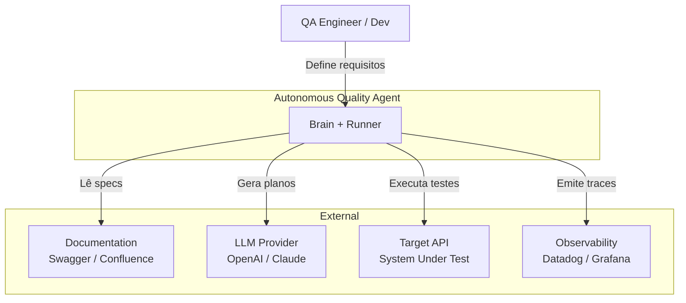
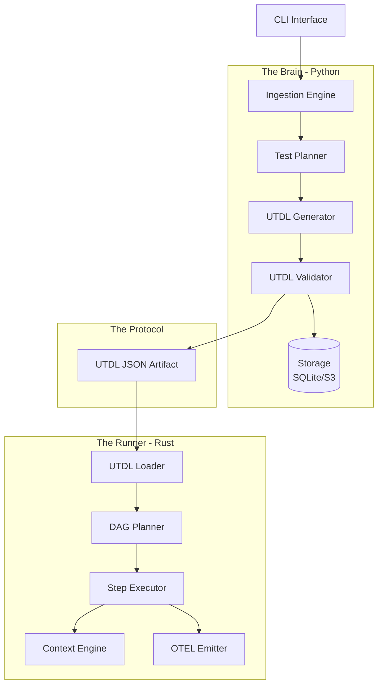
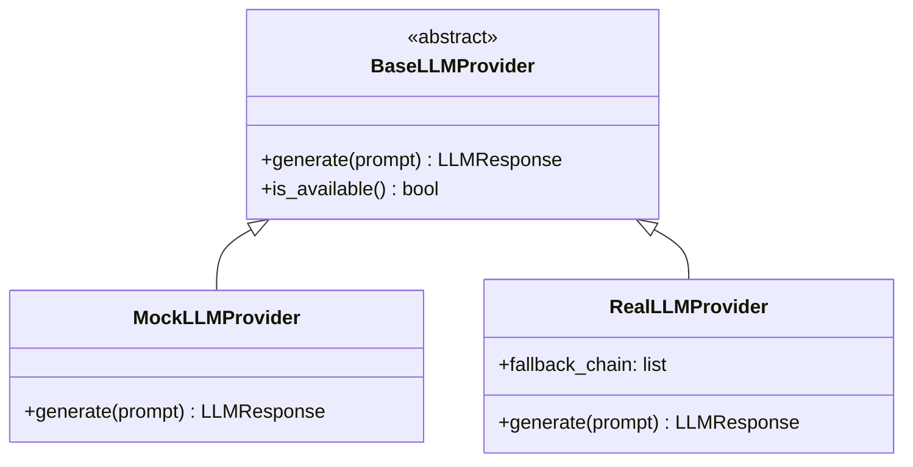
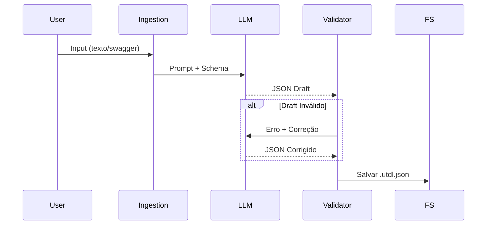
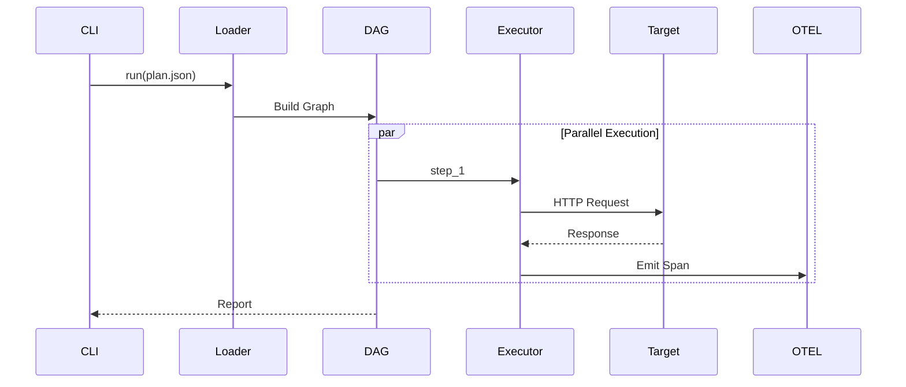
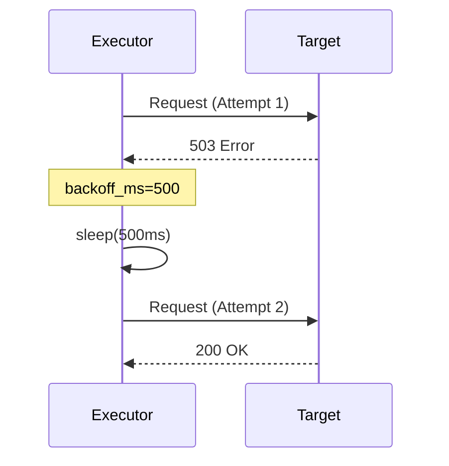
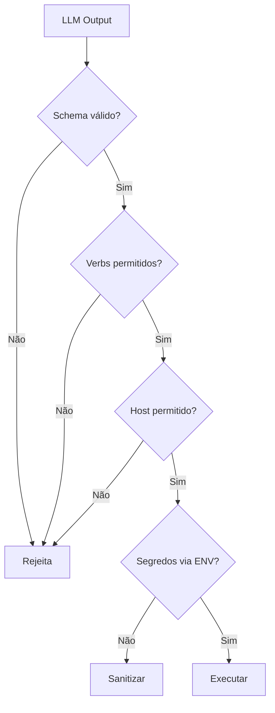

# Autonomous Quality Agent - Architecture Guide

> Documento técnico: arquitetura, decisões de design, especificação UTDL e modelos C4.

## Índice

1. [Visão Geral](#1-visão-geral)
2. [Arquitetura C4](#2-arquitetura-c4)
3. [Especificação UTDL](#3-especificação-utdl)
4. [Brain (Python)](#4-brain-python)
5. [Runner (Rust)](#5-runner-rust)
6. [Fluxos de Dados](#6-fluxos-de-dados)
7. [Segurança](#7-segurança)
8. [Decisões de Design](#8-decisões-de-design)

---

## 1. Visão Geral

O **Autonomous Quality Agent (AQA)** é uma plataforma de engenharia de qualidade que transforma requisitos em testes executáveis usando IA.

### Princípios Fundamentais

1. **Desacoplamento**: Inteligência (Brain) separada de Execução (Runner)
2. **Contrato Explícito**: UTDL como protocolo entre componentes
3. **Determinismo**: Mesmo input = mesmo output
4. **Observabilidade**: Telemetria nativa (OpenTelemetry)
5. **Segurança**: Zero-trust, segredos nunca em disco

### Componentes Principais

| Componente | Linguagem | Responsabilidade |
|------------|-----------|------------------|
| **Brain** | Python | Interpretação, geração, validação |
| **Runner** | Rust | Execução de alta performance |
| **UTDL** | JSON | Contrato entre Brain e Runner |

---

## 2. Arquitetura C4

### 2.1 Diagrama de Contexto (Level 1)



### 2.2 Diagrama de Containers (Level 2)



### 2.3 Descrição dos Containers

#### Brain (Python)

| Módulo | Responsabilidade |
|--------|------------------|
| `ingestion/` | Parsing de OpenAPI, detecção de auth |
| `generator/` | Construção de planos via LLM |
| `validator/` | Validação estrutural de UTDL |
| `llm/` | Providers de LLM (mock/real) |
| `storage/` | Persistência (SQLite/S3/JSON) |
| `cli/` | Interface de linha de comando |

#### Runner (Rust)

| Módulo | Responsabilidade |
|--------|------------------|
| `loader/` | Parsing e validação de UTDL |
| `planner/` | Construção de DAG de execução |
| `executors/` | HTTP, Wait, GraphQL executors |
| `context/` | Variáveis e interpolação |
| `extractors/` | Extração de dados de respostas |
| `telemetry/` | Tracing e métricas OTEL |

---

## 3. Especificação UTDL

UTDL (Universal Test Definition Language) é o protocolo de comunicação entre Brain e Runner.

### 3.1 Estrutura Raiz

```json
{
  "spec_version": "0.1",
  "meta": {
    "id": "uuid-v4",
    "name": "Nome do plano",
    "description": "Descrição opcional",
    "tags": ["api", "smoke"],
    "created_at": "2025-01-01T00:00:00Z"
  },
  "config": {
    "base_url": "https://api.example.com",
    "timeout_ms": 5000,
    "global_headers": {
      "Content-Type": "application/json"
    },
    "variables": {
      "env": "staging"
    }
  },
  "steps": []
}
```

### 3.2 Definição de Step

```json
{
  "id": "unique_step_id",
  "description": "Descrição opcional",
  "depends_on": ["step_anterior"],
  "action": "http_request",
  "params": { ... },
  "assertions": [ ... ],
  "extract": [ ... ],
  "recovery_policy": { ... }
}
```

#### Campos

| Campo | Tipo | Obrigatório | Descrição |
|-------|------|-------------|-----------|
| `id` | string | ✔ | Identificador único |
| `description` | string | ❌ | Texto para logs |
| `depends_on` | array | ❌ | IDs de steps dependentes |
| `action` | enum | ✔ | Tipo de ação |
| `params` | object | ✔ | Parâmetros da ação |
| `assertions` | array | ❌ | Regras de validação |
| `extract` | array | ❌ | Regras de extração |
| `recovery_policy` | object | ❌ | Política de retry |

#### Actions Suportadas

| Action | Descrição |
|--------|-----------|
| `http_request` | Requisição HTTP |
| `wait` | Pausa em milissegundos |
| `sleep` | Alias para `wait` |
| `graphql` | Requisição GraphQL |

### 3.3 Ação: http_request

```json
{
  "action": "http_request",
  "params": {
    "method": "POST",
    "path": "/users",
    "headers": {
      "Authorization": "Bearer ${auth_token}"
    },
    "body": {
      "name": "Test User",
      "email": "test-${random_uuid}@example.com"
    }
  }
}
```

### 3.4 Assertions

| Tipo | Descrição | Campos |
|------|-----------|--------|
| `status_code` | Valida HTTP status | `value` |
| `latency` | Valida tempo (ms) | `value` (max) |
| `json_body` | Valida campo JSON | `path`, `value` |
| `header` | Valida header | `name`, `value` |

#### Operadores

| Operador | Descrição |
|----------|-----------|
| `eq` | Igual |
| `ne` | Diferente |
| `lt` | Menor que |
| `gt` | Maior que |
| `lte` | Menor ou igual |
| `gte` | Maior ou igual |
| `contains` | Contém substring |
| `exists` | Campo existe |

#### Exemplo

```json
"assertions": [
  { "type": "status_code", "operator": "eq", "value": 200 },
  { "type": "latency", "operator": "lt", "value": 500 },
  { "type": "json_body", "path": "$.user.role", "operator": "eq", "value": "admin" }
]
```

### 3.5 Extração

```json
"extract": [
  {
    "source": "body",
    "path": "$.auth.token",
    "target": "auth_token"
  },
  {
    "source": "header",
    "path": "X-Request-Id",
    "target": "request_id"
  }
]
```

| Campo | Descrição |
|-------|-----------|
| `source` | `body`, `header`, `status_code` |
| `path` | JSONPath ou nome do header |
| `target` | Nome da variável de destino |
| `regex` | Regex opcional para extração |
| `all_values` | Extrair todos os matches |
| `critical` | Falha se extração falhar |

### 3.6 Interpolação

| Sintaxe | Descrição |
|---------|-----------|
| `${var}` | Variável do contexto |
| `${env:VAR}` | Variável de ambiente |
| `${random_uuid}` | UUID v4 aleatório |
| `${timestamp}` | ISO8601 timestamp |
| `${timestamp_ms}` | Epoch em milissegundos |
| `${random_int}` | Inteiro aleatório |
| `${base64:text}` | Codifica em Base64 |
| `${sha256:text}` | Hash SHA-256 |

### 3.7 Recovery Policy

```json
"recovery_policy": {
  "strategy": "retry",
  "max_attempts": 3,
  "backoff_ms": 500,
  "backoff_factor": 2.0
}
```

| Estratégia | Descrição |
|------------|-----------|
| `retry` | Tenta novamente com backoff |
| `fail_fast` | Falha imediatamente |
| `ignore` | Ignora falha, continua |

### 3.8 Invariantes

1. `id` de steps deve ser único
2. `depends_on` não pode criar ciclos (DAG only)
3. Variáveis interpoladas devem existir
4. Falha em assert = step falha
5. Segredos sempre via `${env:VAR}`

---

## 4. Brain (Python)

### 4.1 Stack Tecnológica

| Componente | Tecnologia |
|------------|------------|
| Validação | Pydantic v2 |
| LLM | LiteLLM |
| CLI | Click |
| Parsing | PyYAML, orjson |
| Testes | pytest |
| Tipos | pyright |

### 4.2 LLM Provider Strategy



### 4.3 Detecção de Segurança

O Brain detecta automaticamente esquemas de autenticação em specs OpenAPI:

| Tipo | Ação Gerada |
|------|-------------|
| `apiKey` | Header com `${env:API_KEY}` |
| `http_bearer` | Step de login + extração |
| `http_basic` | Header com `${base64:user:pass}` |
| `oauth2` | Step de token endpoint |

### 4.4 Geração de Casos Negativos

Casos negativos automáticos a partir do schema:

| Tipo | Status Esperado |
|------|-----------------|
| `missing_required` | 400, 422 |
| `invalid_type` | 400, 422 |
| `string_too_long` | 400, 422 |
| `invalid_format` | 400, 422 |
| `invalid_enum` | 400, 422 |

---

## 5. Runner (Rust)

### 5.1 Stack Tecnológica

| Componente | Crate |
|------------|-------|
| Async | tokio |
| HTTP | reqwest |
| JSON | serde, serde_json |
| CLI | clap |
| Telemetria | tracing, opentelemetry |
| Erros | anyhow, thiserror |

### 5.2 Trait StepExecutor

```rust
#[async_trait]
pub trait StepExecutor: Send + Sync {
    fn can_handle(&self, action: &str) -> bool;
    
    async fn execute(
        &self,
        step: &Step,
        ctx: &mut Context
    ) -> Result<StepResult>;
}
```

### 5.3 Executores Disponíveis

| Executor | Action | Descrição |
|----------|--------|-----------|
| `HttpExecutor` | `http_request` | Requisições HTTP |
| `WaitExecutor` | `wait`, `sleep` | Pausas |
| `GraphQLExecutor` | `graphql` | Requisições GraphQL |

### 5.4 Códigos de Erro

| Faixa | Categoria |
|-------|-----------|
| E1xxx | Validação |
| E2xxx | Execução HTTP |
| E3xxx | Assertions |
| E4xxx | I/O e Config |
| E5xxx | Internos |

### 5.5 Limites de Execução

| Limite | Padrão | Variável |
|--------|--------|----------|
| `max_steps` | 100 | `RUNNER_MAX_STEPS` |
| `max_parallel` | 10 | `RUNNER_MAX_PARALLEL` |
| `max_retries_total` | 50 | `RUNNER_MAX_RETRIES` |
| `max_execution_secs` | 300 | `RUNNER_MAX_EXECUTION_SECS` |

---

## 6. Fluxos de Dados

### 6.1 Geração de Plano



### 6.2 Execução de Plano



### 6.3 Retry & Recovery



---

## 7. Segurança

### 7.1 Modelo de Ameaças (STRIDE)

| Categoria | Risco | Mitigação |
|-----------|-------|-----------|
| Spoofing | Step alterado | Hash + assinatura |
| Tampering | UTDL modificado | Validação dupla |
| Repudiation | Sem rastreio | TraceID OTEL |
| Information Disclosure | Vazamento de segredos | Secret redaction |
| Denial of Service | 10k steps | Limite de steps |
| Elevation | DELETE destrutivo | Blocklist de verbs |

### 7.2 Regras de Segurança

1. **Brain nunca vê segredos reais**
2. **UTDL nunca contém segredos**
3. **Segredos só via ENV no Runner**
4. **Logs nunca mostram segredos**
5. **Telemetria nunca envia segredos**

### 7.3 Fluxo de Validação



---

## 8. Decisões de Design

### 8.1 Por que Rust para o Runner?

| Aspecto | Benefício |
|---------|-----------|
| Segurança de memória | Zero data races |
| Performance | Binário inicia em ms |
| Concorrência | Milhares de requests |
| Consumo | RAM mínimo |
| Escalabilidade | Ideal para serverless |

### 8.2 Por que Python para o Brain?

| Aspecto | Benefício |
|---------|-----------|
| Ecossistema LLM | LiteLLM, OpenAI SDK |
| Prototipagem | Desenvolvimento rápido |
| Validação | Pydantic v2 |
| Comunidade | Ampla adoção |

### 8.3 Por que UTDL como JSON?

| Aspecto | Benefício |
|---------|-----------|
| Legibilidade | Humano pode ler/editar |
| Versionamento | Git-friendly |
| Validação | JSON Schema |
| Portabilidade | Qualquer linguagem parseia |
| Debug | Inspecionar intermediário |

### 8.4 Por que desacoplar Brain e Runner?

| Aspecto | Benefício |
|---------|-----------|
| Evolução | Atualizar separadamente |
| Testes | Testar isoladamente |
| Distribuição | Rodar em máquinas diferentes |
| Extensibilidade | Novos runners possíveis |

---

## Referências

- [User Guide](./user-guide.md) - Como usar o AQA
- [Developer Guide](./developer-guide.md) - Como contribuir
- [Error Codes](./error_codes.md) - Referência de erros
- [Environment Variables](./environment_variables.md) - Variáveis de ambiente
